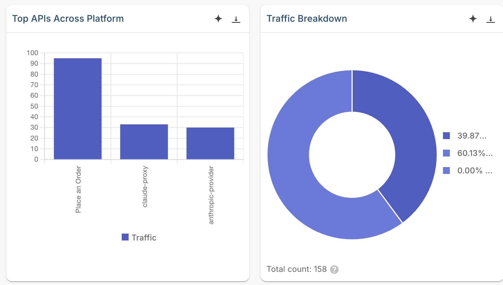
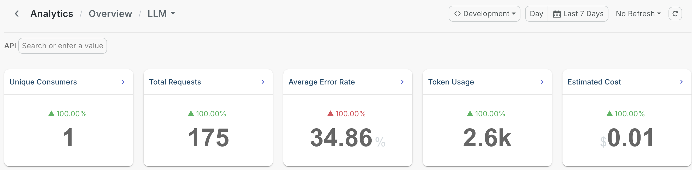

# Observe LLM traffic on the AI Gateway

## Overview

AI traffic raises questions ordinary API monitoring can't answer. A request count tells you nothing about which model spent your token budget, what a conversation cost, or which guardrail rejected a prompt.

The WSO2 AI Gateway reports on the large language model (LLM) proxies that front your model providers. For each one you can observe request rate, latency, and error rate, along with token usage and estimated cost per proxy and per model, and how often your guardrails fired.

This guide shows you where to find each of those figures and how to read them.

## Learning objectives

- Send LLM traffic through the AI Gateway, including a request that fails
- Find request volume, latency, and error rate on the Overview dashboard
- Read token usage, estimated cost, and model distribution on LLM APIs Analytics
- Confirm guardrail activity and see the mix of failure causes

## What you can observe

| | |
|---|---|
| **Request volume and rate** | Per proxy, per provider, and per model, over any time range |
| **Latency** | Average and P95 per model, so a slow tail shows up rather than hiding behind an average |
| **Error rate** | Broken down by cause: policy violations, authentication, rate limits, or provider-side failures |
| **Token usage** | Prompt and completion tokens, over time and per model |
| **Estimated cost** | Spend per model, and a cost trend you can budget against |
| **Guardrail triggers** | How often each guardrail fired |
| **Consumers** | Which applications are driving the load |

## Prerequisites

- A WSO2 API Platform account. [Sign up for free](https://console.bijira.dev).
- An AI gateway that shows **Active** in the AI Workspace. See [Setting up an AI Gateway](../../cloud/ai-workspace/ai-gateways/setting-up.md).
- An [LLM provider](../../cloud/ai-workspace/llm-providers/configure-provider.md) deployed to that gateway. Add an [App LLM proxy](../../cloud/ai-workspace/llm-proxies/configure-proxy.md) as well if you want per-application authentication or guardrails.
- An API key and the invoke URL for the provider or proxy you want to observe.
- `curl` for sending test traffic.

If you're new to the AI Workspace, [Get started with AI Workspace](../../cloud/ai-workspace/getting-started.md) covers the gateway and provider setup end to end.

!!! note
    Insights in the AI Workspace is powered by [Moesif](https://www.moesif.com/) and comes integrated, so there's nothing to connect. If your organization was created before February 20, 2026 and you already have a Moesif organization you want to use, see [Integrate API Platform with Moesif](../../cloud/monitoring-and-insights/integrate-bijira-with-moesif.md).

## Step 1: Send traffic through your gateway

Send a few requests, including one that fails, so both the traffic panels and the error panels have data to show.

1. Send three requests to your LLM proxy, changing the question each time:

    ```bash
    curl -k -X POST https://<LLM-PROXY-INVOKE-URL>/v1/messages \
      -H "X-API-Key: <YOUR-API-KEY>" \
      -H "Content-Type: application/json" \
      -H "anthropic-version: 2023-06-01" \
      -d '{
        "model": "<YOUR-MODEL>",
        "max_tokens": 64,
        "messages": [{"role": "user", "content": "What is the capital of France?"}]
      }'
    ```

    **Expected result:** `HTTP 200` with a model response.

    !!! note
        This guide uses an Anthropic provider, so the request follows Anthropic's format. Send yours in the format your provider expects, with a model your provider account has access to.

2. Repeat one request without the `X-API-Key` header.

    **Expected result:** `HTTP 401 Unauthorized`.

## Step 2: Open Insights and set the scope

1. Sign in to [WSO2 API Platform](https://console.bijira.dev/), then click **AI Workspace** in the header.
2. Select your organization and project from the selectors at the top of the page.
3. In the left navigation menu, click **Insights**.
4. Set **Environment** to the environment your proxies are deployed to, such as **Development**.
5. Set the time range to cover the period you want to look at.

**Expected result:** The **Overview** dashboard opens with summary tiles above a set of charts.

{.cInlineImage-full}

## Step 3: Check overall health on the Overview dashboard

The Overview dashboard answers one question: is anything wrong right now? Start here before opening a specific dashboard.

1. Read the summary tiles. **Total Requests** and **Total Errors** cover all your traffic, and **LLM Traffic** shows how much of it is model calls.
2. Check **Overall Platform Metrics** for traffic, errors, and throttled requests on one chart. Spikes that line up tell you demand caused the failures; errors rising on flat traffic point somewhere else.
3. Check **Average Latency over Time**. A single tall spike is usually one slow request and can be ignored. A line that rises and stays high means something changed, such as the model slowing down or the gateway coming under load.
4. Use **Traffic Breakdown**, **Top APIs Across Platform**, and **Top Applications** to see which proxies and which consumers are generating the load.

{.cInlineImage-full}

The Overview dashboard also charts traffic intensity by day and hour, client platforms and user agents, new consumer registrations, and request origin on a geographic map. See [Insights overview](../../cloud/monitoring-and-insights/insights.md) for the full list.

## Step 4: Read LLM usage, tokens, and cost

Click **View Details** on the **LLM Traffic** tile to open **LLM APIs Analytics**. This is where the AI-specific figures live.

Five summary tiles sit at the top. **Unique Consumers**, **Total Requests** and **Average Error Rate** cover the operational picture, and two carry the figures that only matter for AI traffic:

- **Token Usage**: total tokens consumed across the window.
- **Estimated Cost**: what that consumption is worth at provider pricing.

{.cInlineImage-full}

Then work down the panels:

| Panel | What to look for |
|---|---|
| **AI Application Details** | Token usage and cost broken out per application and provider. Application Name reads `(none)` for traffic the gateway couldn't attribute to a GenAI application. |
| **Cost Trend per Provider** | Spend over time for each provider, for budgeting and for catching an anomaly early. |
| **Traffic Share by Provider and Model** | Which models carried the traffic. On a proxy that distributes across several, this is where you confirm the split matches the policy you configured. |
| **Request Intensity (Day vs Hour)** | When the AI traffic arrived, by weekday and hour. |
| **Latency Trend** | P95 latency per model, so a slow tail shows up rather than hiding behind an average. |
| **AI API Details** | Token usage and request count per proxy or provider. Compare its request count against **Total Requests**: the difference is the requests that failed before reaching a model. |
| **Guardrail Triggers** | How often each guardrail fired, named individually. This is where you confirm a new guardrail is working. |
| **Error Type Breakdown** | The mix of fault categories across failed requests: `AUTH` for rejected credentials, `THROTTLED` for rate limits, `TARGET_CONNECTIVITY` for a provider the gateway couldn't reach, and `OTHER` for everything else. |

## Verify

1. On the Overview dashboard, confirm **LLM Traffic** shows a count and **Total Errors** counts your failed request.
2. On **LLM APIs Analytics**, confirm **Token Usage** and **Estimated Cost** show figures for the model you called.

## Troubleshooting

| Symptom | Resolution |
|---|---|
| No data on any dashboard | Start the gateway with `docker compose --env-file configs/keys.env up`, using the file generated when you registered the gateway. It holds the key the runtime publishes with. |
| Every tile reads zero | Set **Environment** to the environment your proxies are deployed to. |
| You want estimated cost alongside token usage | Cost is calculated from provider pricing, so call a model the pricing data covers. |
| You want token usage and cost attributed to individual applications | Map the proxy's API keys to a [GenAI application](../../cloud/ai-workspace/genai-applications.md). **AI Application Details** and **Top Applications** then group by that application name. |

## Next steps

- [Insights overview](../../cloud/monitoring-and-insights/insights.md): every dashboard, metric, and chart available in Insights
- [Enforce token-based rate limiting on an LLM proxy](enforce-token-based-rate-limiting-on-an-llm-proxy.md): act on the token figures by capping consumption per window
- [Set up a governed multi-model LLM proxy with cost controls and failover](set-up-a-governed-multi-model-llm-proxy-with-cost-controls-and-failover.md): distribute traffic across models, then confirm the split in **Traffic Share by Model**
- [Guardrails overview](../../cloud/ai-workspace/policies/guardrails/overview.md): add guardrails, then watch them in **Guardrail Triggers**

## Try the samples

Two companion samples run the AI Gateway against a mock model, so no provider account or API key is required.

- [LLM analytics with Moesif](https://github.com/wso2/api-platform/tree/main/samples/ai-gateway-moesif-analytics): generates mixed traffic and reports it on the same Insights dashboards this guide covers.
- [LLM metrics and tracing](https://github.com/wso2/api-platform/tree/main/samples/ai-gateway-observability): runs Prometheus, Grafana, and Jaeger alongside the gateway for the runtime's own metrics and per-request traces.

On a standalone AI Gateway you choose how to observe it. Point the runtime at Moesif for the analytics dashboards, or at Prometheus, Grafana, and Jaeger for metrics and traces.
