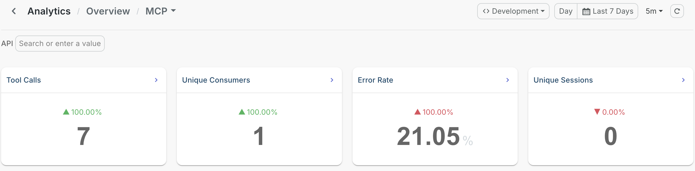
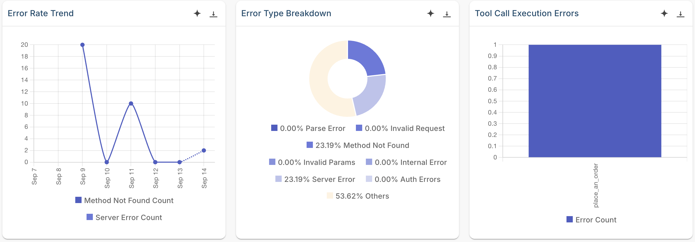

# Observe MCP traffic on the AI Gateway

## Overview

When AI agents call tools through your gateway, ordinary API monitoring tells you very little. A request count doesn't say which tool the agent reached for, how many agent runs it took, or whether a failure came from the agent or from your tool.

The WSO2 AI Gateway reports on the Model Context Protocol (MCP) proxies that expose your tools to agents. For each one you can observe call volume per tool, agent sessions, which client runtimes are calling, latency, and the error types behind every failure.

This guide shows you where to find each of those figures and how to read them.

## Learning objectives

- Send MCP traffic through the AI Gateway, including a call that fails
- Find call volume, latency, and error rate on the Overview dashboard
- Read tool usage, agent sessions, and client distribution on MCP Analytics
- Tell a broken tool apart from a misbehaving agent

## What you can observe

| | |
|---|---|
| **Tool calls** | Call volume in total and per tool, over any time range |
| **Agent sessions** | How many separate agent runs your tools served |
| **Client distribution** | Which agent runtimes are calling, by name and version |
| **Latency** | Call volume alongside execution time, so a slow tool shows up |
| **Error rate and trend** | What share of calls failed, and whether it is improving |
| **Error types** | Parse errors, invalid requests, missing methods, server errors |
| **Tool call execution errors** | Which individual tools are failing |
| **Consumers** | Which applications and agents are driving the load |

## Prerequisites

- A WSO2 API Platform account. [Sign up for free](https://console.bijira.dev).
- An AI gateway that shows **Active** in the AI Workspace. See [Setting up an AI Gateway](../../cloud/ai-workspace/ai-gateways/setting-up.md).
- An [MCP proxy](../../cloud/ai-workspace/mcp-proxies/configure-proxy.md) fronting an MCP server, deployed to that gateway.
- The invoke URL for the proxy, and an API key if the proxy has authentication enabled.
- `curl` for sending test traffic.

If you're new to the AI Workspace, [Get started with AI Workspace](../../cloud/ai-workspace/getting-started.md) covers the gateway and proxy setup end to end.

!!! note
    Insights in the AI Workspace is powered by [Moesif](https://www.moesif.com/) and comes integrated, so there's nothing to connect. If your organization was created before February 20, 2026 and you already have a Moesif organization you want to use, see [Integrate API Platform with Moesif](../../cloud/monitoring-and-insights/integrate-bijira-with-moesif.md).

## Step 1: Send traffic through your gateway

An MCP client introduces itself before it calls anything. It sends an `initialize` request carrying a `clientInfo` block with its name and version, and the server replies with a session ID in an `Mcp-Session-Id` header. Every later call carries that header.

Follow the same sequence here. Skipping it still produces tool calls, but the panels that group by client and by session stay empty.

1. Open a session:

    ```bash
    curl -k -i -X POST https://<MCP-PROXY-INVOKE-URL> \
      -H "X-API-Key: <YOUR-API-KEY>" \
      -H "Content-Type: application/json" \
      -H "Accept: application/json, text/event-stream" \
      -d '{
        "jsonrpc": "2.0",
        "id": 1,
        "method": "initialize",
        "params": {
          "protocolVersion": "2025-06-18",
          "capabilities": {},
          "clientInfo": {"name": "insights-demo-client", "version": "1.0.0"}
        }
      }'
    ```

    **Expected result:** `HTTP 200`, with an `Mcp-Session-Id` header in the response. Copy that value for the calls below.

2. Ask the proxy for its tool list, passing the session ID:

    ```bash
    curl -k -X POST https://<MCP-PROXY-INVOKE-URL> \
      -H "X-API-Key: <YOUR-API-KEY>" \
      -H "Content-Type: application/json" \
      -H "Accept: application/json, text/event-stream" \
      -H "Mcp-Session-Id: <SESSION-ID>" \
      -d '{"jsonrpc": "2.0", "id": 2, "method": "tools/list"}'
    ```

    **Expected result:** `HTTP 200` with the tools the proxy exposes, including the arguments each one takes.

3. Call one of those tools a few times, changing the arguments each time:

    ```bash
    curl -k -X POST https://<MCP-PROXY-INVOKE-URL> \
      -H "X-API-Key: <YOUR-API-KEY>" \
      -H "Content-Type: application/json" \
      -H "Accept: application/json, text/event-stream" \
      -H "Mcp-Session-Id: <SESSION-ID>" \
      -d '{
        "jsonrpc": "2.0",
        "id": 3,
        "method": "tools/call",
        "params": {"name": "<TOOL-NAME>", "arguments": {}}
      }'
    ```

    **Expected result:** `HTTP 200` with the tool's result.

4. Call a tool that doesn't exist, so the error panels have data:

    ```bash
    curl -k -X POST https://<MCP-PROXY-INVOKE-URL> \
      -H "X-API-Key: <YOUR-API-KEY>" \
      -H "Content-Type: application/json" \
      -H "Accept: application/json, text/event-stream" \
      -H "Mcp-Session-Id: <SESSION-ID>" \
      -d '{"jsonrpc": "2.0", "id": 4, "method": "tools/call", "params": {"name": "no-such-tool", "arguments": {}}}'
    ```

    **Expected result:** `HTTP 200` with a JSON-RPC error saying the method was not found.

!!! tip
    Repeat step 1 with a different `clientInfo` name to open a second session. Two named clients give **Client Distribution** and **Unique Sessions** something to compare.

## Step 2: Open Insights and set the scope

1. Sign in to [WSO2 API Platform](https://console.bijira.dev/), then click **AI Workspace** in the header.
2. Select your organization and project from the selectors at the top of the page.
3. In the left navigation menu, click **Insights**.
4. Set **Environment** to the environment your proxy is deployed to, such as **Development**.
5. Set the time range to cover the period you want to look at.

**Expected result:** The **Overview** dashboard opens with summary tiles above a set of charts.

{.cInlineImage-full}

## Step 3: Check overall health on the Overview dashboard

The Overview dashboard answers one question: is anything wrong right now? Start here before opening a specific dashboard.

1. Read the summary tiles. **Total Requests** and **Total Errors** cover all your traffic, and **MCP Traffic** shows how much of it is agent tool calls.
2. Check **Overall Platform Metrics** for traffic, errors, and throttled requests on one chart. Spikes that line up tell you demand caused the failures; errors rising on flat traffic point somewhere else.
3. Check **Average Latency over Time**. A single tall spike is usually one slow call and can be ignored. A line that rises and stays high means something changed, such as a tool's backend slowing down.
4. Use **Traffic Breakdown**, **Top APIs Across Platform**, and **Top Applications** to see which proxies and which consumers are generating the load.

{.cInlineImage-full}

The Overview dashboard also charts traffic intensity by day and hour, client platforms and user agents, new consumer registrations, and request origin on a geographic map. See [Insights overview](../../cloud/monitoring-and-insights/insights.md) for the full list.

## Step 4: Read MCP tool activity

Click **View Details** on the **MCP Traffic** tile to open **MCP Analytics**.

Four summary tiles sit at the top:

- **Tool Calls**: how many calls your tools served.
- **Unique Consumers**: how many distinct callers made them.
- **Error Rate**: what share of those calls failed.
- **Unique Sessions**: how many agent runs, rather than how many calls.

{.cInlineImage-full}

Then work through the charts:

| Chart | What to look for |
|---|---|
| **Top Tools by Calls** | Which tools agents actually reach for, so you know which ones to keep reliable. |
| **Traffic Volume over Time** | Call volume alongside latency, so a spike in tool usage slowing execution is visible. |
| **Error Type Breakdown** | Parse errors, invalid requests, missing methods, and invalid parameters point at the calling agent; internal and server errors point at your tool. |
| **Error Rate Trend** | When a problem started, and whether it's improving. |
| **Tool Call Execution Errors** | Which individual tools are failing, so you can tell a broken tool from a misbehaving agent. |
| **Server Distribution** and **Client Distribution** | Which MCP servers carry the load, and which agent runtimes are calling them. |
| **Unique Consumers over Time** | Whether MCP adoption is spreading across teams. |

{.cInlineImage-full}

## Verify

1. On the Overview dashboard, confirm **MCP Traffic** shows a count and **Total Errors** counts your failed call.
2. On **MCP Analytics**, confirm your tool appears under **Top Tools by Calls**.
3. Confirm **Unique Sessions** matches the number of sessions you opened, and **Client Distribution** names your client.

## Troubleshooting

| Symptom | Resolution |
|---|---|
| No data on any dashboard | Start the gateway with `docker compose --env-file configs/keys.env up`, using the file generated when you registered the gateway. It holds the key the runtime publishes with. |
| Every tile reads zero | Set **Environment** to the environment your proxy is deployed to. |
| You want calls attributed to individual consumers | Attach the [MCP Authentication](https://wso2.com/api-platform/policy-hub/policies/mcp-auth) policy to the proxy. The gateway then records the authenticated caller on each event, and **Unique Consumers** groups by that identity. |

## Next steps

- [Insights overview](../../cloud/monitoring-and-insights/insights.md): every dashboard, metric, and chart available in Insights
- [Apply policies to MCP proxies](../../cloud/ai-workspace/mcp-proxies/apply-policies.md): add authentication and access control to your tools, then watch the effect on the consumer and error panels
- [Convert a REST API into an MCP tool](convert-rest-api-to-mcp-server.md): expose an existing API as a governed MCP server
- [Find and connect to an enterprise MCP server from the MCP Hub](find-and-connect-to-an-enterprise-mcp-server-from-the-mcp-hub.md): discover MCP servers and connect an agent to them

## Try the samples

Two companion samples run the AI Gateway with a ready-made MCP server, so you don't need to build one first.

- [MCP analytics with Moesif](https://github.com/wso2/api-platform/tree/main/samples/ai-gateway-moesif-mcp-analytics): generates tool traffic and reports it on the same Insights dashboards this guide covers.
- [MCP metrics and tracing](https://github.com/wso2/api-platform/tree/main/samples/ai-gateway-mcp-observability): runs Prometheus, Grafana, and Jaeger alongside the gateway for the runtime's own metrics and per-request traces.

On a standalone AI Gateway you choose how to observe it. Point the runtime at Moesif for the analytics dashboards, or at Prometheus, Grafana, and Jaeger for metrics and traces.
