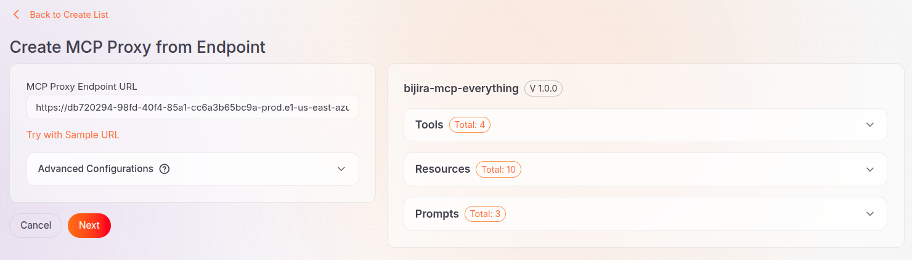
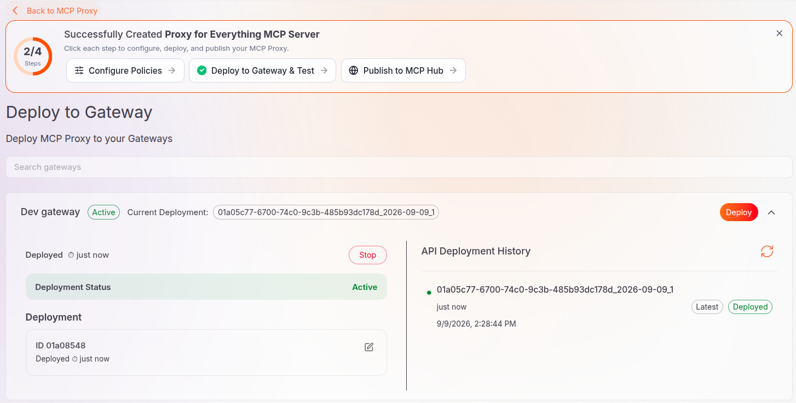
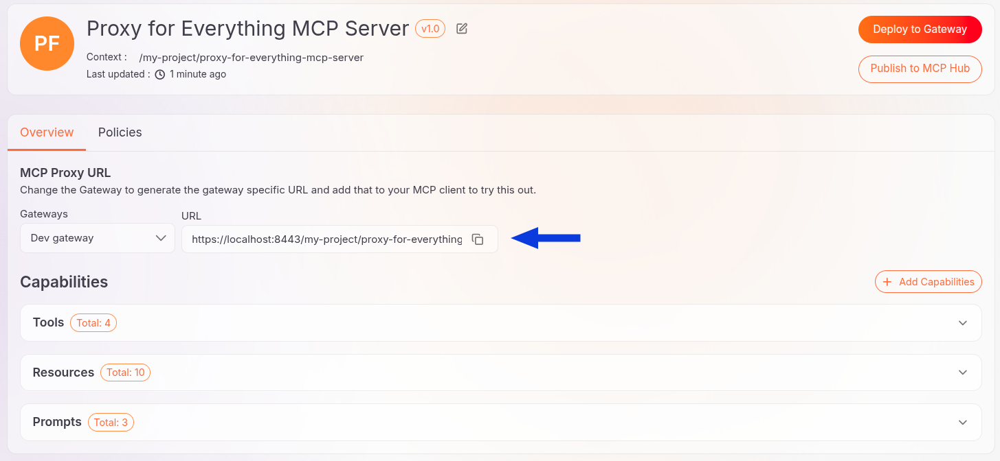
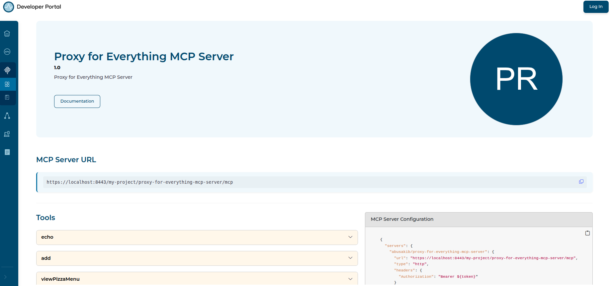
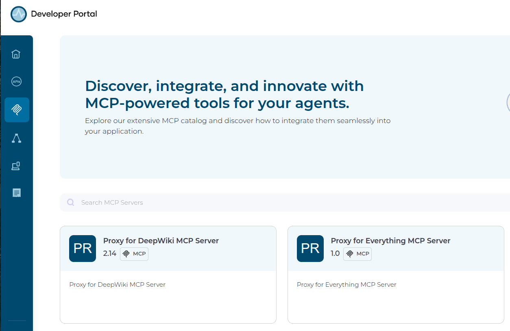

# Publish MCP servers to a governed catalog using AI Workspace and API Portal and MCP Hub

## Overview

This guide shows you how to publish existing MCP servers into a governed, discoverable catalog using AI Workspace and the API Portal and MCP Hub. Without a central, governed catalog, each MCP server your team runs possesses no shared, governed source of truth for consumers or AI agents. By the end, you'll have two MCP servers deployed behind a gateway and published to the API Portal and MCP Hub, discoverable by both humans in the catalog and AI agents through `llms.txt`. A companion sample runs the same governance pattern end to end using self-hosted components using Docker Compose.

## Learning objectives

- Set up an AI Gateway instance.
- Register the AI Gateway runtime with AI Workspace.
- Create MCP proxies on top of two independently running MCP servers, with no server code to write.
- Publish MCP proxies to the API Portal and MCP Hub so they're discoverable as one governed catalog.
- Verify the published MCP servers in the API Portal and MCP Hub.
- Verify that the published MCP servers are discoverable by AI agents.

## Prerequisites

- A WSO2 API Platform account with access to AI Workspace and the API Portal and MCP Hub
- Docker with the Compose plugin, `curl`, and `unzip`, to run the gateway runtime

## Architecture

```
[In AI Workspace]
    |  create gateway; create and deploy two proxies
    v
+------------------------------------------------+
|  AI Gateway (runtime)                           |
|  routes MCP traffic                             |
+------------------------------------------------+
        |                          |
        |  proxy                   |  proxy
        v                          v
+-----------------------+  +-----------------------+
|  Everything MCP       |  |  DeepWiki MCP          |
|  Server               |  |  Server                |
+-----------------------+  +-----------------------+
        |                          |
        |  Publish to MCP Hub      |  Publish to MCP Hub
        v                          v
+------------------------------------------------+
|  API Portal and MCP Hub                         |
|  catalog UI · llms.txt · MCP Playground          |
+------------------------------------------------+
                    |  browse / fetch llms.txt / test
                    v
        [Consumers: developers + AI agents]
```

Both MCP proxies route through the same gateway, but they're two separate catalog entries. Publishing registers each one in your organization's MCP registry. The API Portal and MCP Hub then makes the registry available to both human consumers and AI agents.

## Step 1: Create an AI Gateway

An AI Gateway entry in AI Workspace represents one gateway runtime. Registering it here gets you a token; you still start the runtime yourself with Docker.

1. Go to [AI Workspace](https://ai-workspace.bijira.dev) and sign in. If this is your first time signing in, create an Organization and a Project.
2. Click **AI Gateways** in the left navigation menu.
3. Click **Add AI Gateway**.
4. Fill in the gateway details:

    | Field | Value |
    |---|---|
    | **Name** | A unique name for the gateway |
    | **Description** | An optional description of the gateway |
    | **URL** | The gateway URL, for example `https://localhost:8443` |
    | **Associated Environment** | Select an environment, for example `Development` |

5. Click **Add Gateway**.

**Expected result:** The gateway detail screen opens, showing its status as **Inactive**.

## Step 2: Run the gateway runtime

Select the **Quick Start** tab in the gateway's **Get Started** pane, then run the commands it shows you. Replace _`<version_number>`_ with the latest AI Gateway release version as AI Workspace shows.

1. Download and unzip the gateway distribution:

    ```bash
    curl -sLO https://github.com/wso2/api-platform/releases/download/ai-gateway/v<version_number>/wso2apip-ai-gateway-<version_number>.zip && \
    unzip wso2apip-ai-gateway-<version_number>.zip
    ```

2. Create the environment file with your registration token from Step 1:

    ```bash
    cat > wso2apip-ai-gateway-<version_number>/configs/keys.env << 'ENVFILE'
    GATEWAY_CONTROLPLANE_HOST=connect.bijira.dev
    GATEWAY_REGISTRATION_TOKEN=<your-gateway-token>
    ENVFILE
    ```

3. Start the runtime:

    ```bash
    cd wso2apip-ai-gateway-<version_number> && \
    docker compose --env-file configs/keys.env up
    ```

**Expected result:** Return to the gateway's detail page in AI Workspace and refresh it. Once the runtime connects, the status changes from **Inactive** to **Active**. The __AI Gateways__ page listing the available gateways also shows the gateway as __Active__.

## Step 3: Create an MCP Proxy for the Everything MCP Server
AI Workspace provides a sample MCP server. Follow these steps to create an MCP Proxy for the Everything MCP Server:

1. Click **MCP Proxies** in the left navigation menu.
2. Click **Create MCP Proxy** .
3. Click **Try with Sample URL**.
4. Click **Next**.
    
5. Verify the Proxy details. AI Workspace automatically fills in the details for the sample MCP server.
6. Click **Create**.

**Expected result:** The Proxy is created and its overview page opens.

## Step 4: Deploy the Proxy to your gateway

1. Click **Deploy to Gateway**.
2. Click **Deploy** next to the gateway you created in step 1.

**Expected result:** The deployment status changes to **Active**.



## Step 5: Add the Everything MCP Server Proxy to the API Portal and MCP Hub
After deploying a Proxy, it becomes reachable through the gateway-specific MCP Proxy URL. For example:



By publishing it to the MCP Hub, you make the Proxy discoverable by human consumers and agents through a central, governed catalog.

To publish it to the MCP Hub, follow these steps:

- Go to the overview page of the MCP Proxy.
- Click **Publish to MCP Hub**.
- Confirm the gateway and endpoint URL of the Proxy.
- Click **Publish**.

After successful publication, you can go to the MCP Hub from the Proxy overview screen to view the Proxy.



**Expected result:** The proxy is registered in your organization's MCP registry and becomes discoverable and viewable in the API Portal and MCP Hub.

## Step 6: Create an MCP Proxy for the DeepWiki server

DeepWiki is a public MCP server that answers questions about GitHub repositories. It needs no credentials.

Follow these steps to create an MCP Proxy for this MCP server:

1. Click **MCP Proxies** in the left navigation menu.
2. Click **Create MCP Proxy** .
3. Enter the upstream MCP server URL `https://mcp.deepwiki.com/mcp`.
4. Click **Fetch Server Info**.
5. Click **Next**.
6. Verify the Proxy details. Give the Proxy a distinct **Name** and a distinct **Context** so it doesn't collide with the Everything MCP Server Proxy.
7. Click **Create**.

Then repeat the steps in step 4 to deploy this Proxy to your AI Gateway instance.

**Expected result:** The Proxy is created and its deployment status changes to **Active**.

## Step 7: Add the DeepWiki MCP Server Proxy to the API Portal and MCP Hub
Repeat step 5 to publish the DeepWiki MCP Server Proxy to the MCP Hub.

**Expected result:** The proxy is registered in your organization's MCP registry and becomes discoverable and viewable in the API Portal and MCP Hub.

## Verify

Open the [API Portal and MCP Hub](https://devportal.bijira.dev) and sign in. Confirm that both MCP servers appear in the **MCP Servers** catalog.



AI agents can discover and understand your organization's API Portal and Hub through an `llms.txt` file. API Portal and MCP Hub automatically generates an `llms.txt` for your organization with information about the available APIs and MCP servers. You can add further information to it.

To verify that the `llms.txt` file contains the two MCP servers you have published, follow these steps:

1. Click **Settings** in the navigation menu
2. Go to the __LLM Instructions__ tab.
3. Make sure that the **Portal is AI-discoverable** toggle is on and note the endpoint where `llms.txt` is available, for example, `/alex/views/default/llms.txt`.
4. Verify that `llms.txt` contains the MCP servers you added in this guide.

You can also open the `llms.txt` preview in another tab to see the current `llms.txt`. To add more information, configure the portal name and description. The preview changes as you add these information. Then click **Publish** to publish the updated `llms.txt`.


## Troubleshooting

| Symptom | Resolution |
|---|---|
| MCP Server URL fetch fails when creating the proxy | Confirm the URL ends in `/mcp` and is reachable without credentials. Both servers used in this guide are public and requires no credentials. |
| Unable to publish an MCP Proxy | Confirm the Proxy's deployment status is **Active**. You must deploy a Proxy before you can publish it. |
| A proxy doesn't appear in the API Portal and MCP Hub after publishing | Allow a few moments for the catalog to refresh, then reload the page. |

## Next steps

- [Apply policies to an MCP proxy](../../cloud/ai-workspace/mcp-proxies/apply-policies.md).
- [Find and connect to an enterprise MCP server from the MCP Hub](./find-and-connect-to-an-enterprise-mcp-server-from-the-mcp-hub.md)
- [Learn more about LLM Instructions](../../cloud/devportal/admin-settings/llm-instructions/)
- See guides to get started with standalone [AI Workspace](../../ai-workspace/1.0.0/getting-started.md) and [API Portal and MCP Hub](../../api-portal/1.0.0/quickstart-guide.md).

## Try the sample

The companion sample runs this same governance pattern end to end using using Docker Compose. The sample uses self-hosted, standalone components. You will learn how to publish two MCP servers through the Management API. You will then verify them through the MCP Registry API and the API Portal and MCP Hub UI. You don't need a Cloud account to run the sample.

[View the sample on GitHub](https://github.com/wso2/api-platform/tree/main/samples/mcp-registry-catalog).
