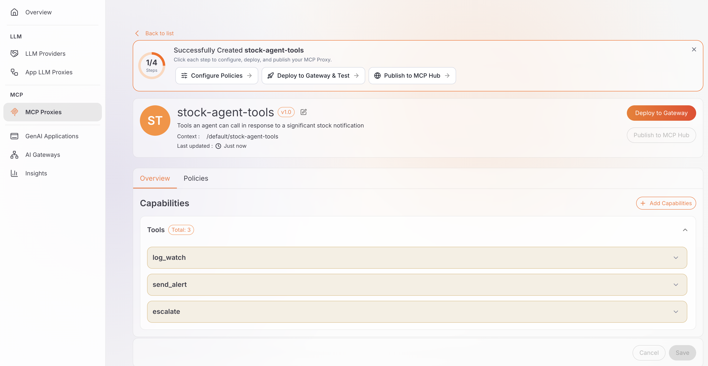
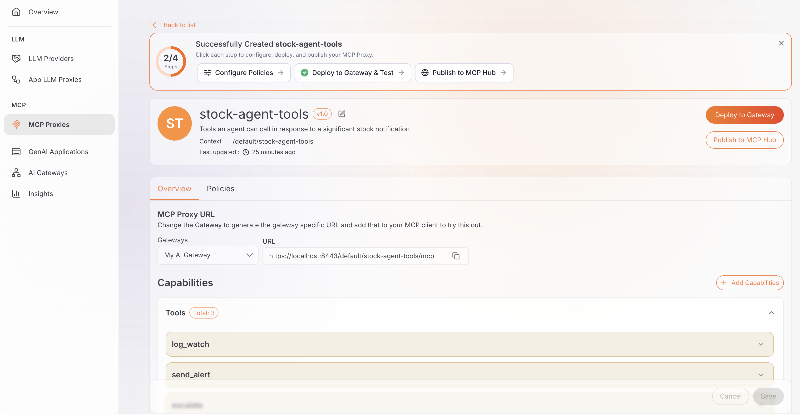
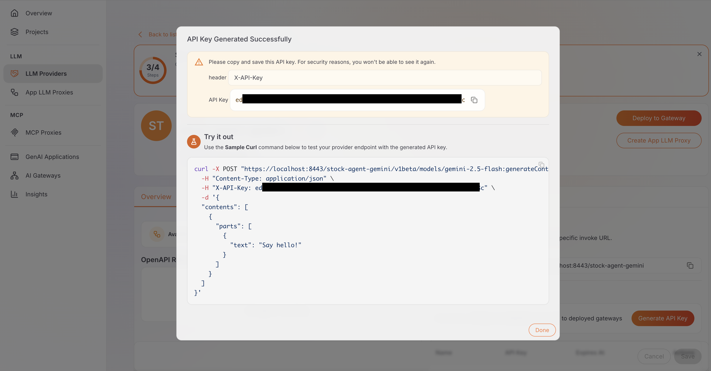
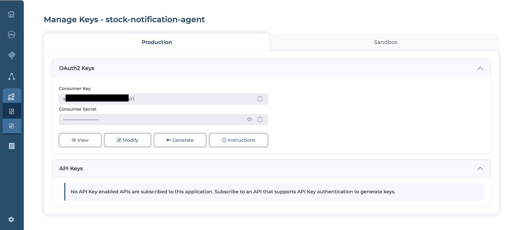

# Build an AI agent that reacts to WebSocket notifications

## Overview

This guide continues from [Build a WebSocket-based real-time notification system](build-a-websocket-notification-system.md). It connects a Python agent to that guide's Stock Notifications API, and for any tick that crosses an alert threshold, asks Gemini which of a small set of tools to call in response, then actually calls it through a governed MCP proxy. Below-threshold ticks never reach the LLM at all.

By the end, you'll have a running agent that autonomously chooses between logging a watch note, raising an alert, or escalating for human follow-up, spanning two separate WSO2 consoles: WSO2 API Platform Cloud for the WebSocket API, and AI Workspace for the MCP proxy and LLM provider.

!!! note
    This guide assumes you've already completed the previous guide and have your Stock Notifications API deployed. Publishing it and finding its `wss://` invoke URL happen in Step 5.

## Key concepts

Before you start, here are the WSO2 API Platform terms this guide adds to the ones from the previous guide.

*AI Workspace* is a separate WSO2 console for creating and governing the MCP proxy and LLM provider an AI agent calls. You sign in to it at its own URL, apart from the WSO2 API Platform Cloud console you used for the WebSocket API in the previous guide, and it keeps its own organizations and projects.

An *AI gateway* is the runtime that executes AI Workspace's MCP proxies and LLM providers. You install and start it yourself (Docker, a VM, or Kubernetes), then connect it to AI Workspace with a registration token. Nothing you create in AI Workspace is callable until it's deployed to an active AI gateway.

An *MCP proxy* is a governed endpoint AI Workspace creates in front of a server that speaks the Model Context Protocol. It runs on an AI gateway, the same way a WebSocket API proxy runs on WSO2 API Platform Cloud.

An *LLM provider* connects a third-party model service, such as Google Gemini, to AI Workspace, and stores its API key so your agent never holds it directly. Your agent calls the provider's own invoke URL instead of calling Gemini directly.

A *tool* is a single function the agent can choose to call. In this guide, `log_watch`, `send_alert`, or `escalate` are the tools used, each with a name, a description, and a schema for its arguments, discovered from the MCP proxy.

## Prerequisites

- The previous guide completed, with the Stock Notifications API deployed.
- A WSO2 API Platform Cloud account (the same one from the previous guide).
- Access to the [WSO2 AI Workspace](https://ai-workspace.bijira.dev/), a separate console from WSO2 API Platform Cloud. Sign in with a Google, GitHub, or Microsoft account.
- Somewhere to run a small AI gateway runtime, such as Docker.
- A Google AI API key from [Google AI Studio](https://aistudio.google.com/apikey), which the LLM provider uses to call the Gemini API on your behalf.
- Python 3.9 or later, and pip.
- A place to deploy a small MCP server publicly, same as the notification backend in the previous guide.

## Architecture

```
                    wss://.../stock-notifications-api
Python Agent <----------------------------------------- WebSocket API proxy
     |                                                    (WSO2 API Platform Cloud)
     |
     |--- https:// ---> MCP proxy -----> tools-server (your public URL)
     |                       |
     `--- https:// ---> LLM provider --> Gemini API
                              |
                        AI gateway (AI Workspace)
```

The agent holds three separate connections: it listens on the WebSocket API proxy for notifications, and for any that cross the threshold, it calls the LLM provider to decide on a tool and the MCP proxy to actually run it. The WebSocket API proxy lives in WSO2 API Platform Cloud, from the previous guide; the MCP proxy and LLM provider live in the separate AI Workspace console, both running on the same AI gateway.

## Step 1: Set up the tool server

Before you create the MCP proxy, you need a running server that speaks the Model Context Protocol, reachable over the public internet. This guide uses a small server exposing three tools: `log_watch`, `send_alert`, and `escalate`. Each one only prints a message and returns a status -- there's no real alerting or ticketing system behind them. The point is watching Gemini pick the right one, not what happens after.

1. Get `tools-server/server.js` and `package.json` from the [companion sample](https://github.com/wso2/api-platform/tree/main/samples/websocket-notification-agent), into a project folder.
2. In that folder, run `npm install`.
3. Deploy that folder to a host that gives you a public URL, the same way you deployed the notification backend in the previous guide. The host should run `node tools-server/server.js` (or `npm run start:tools-server`) as its start command.

**Expected result:** You have a public URL for the deployed server. You use it, followed by `/mcp`, in the next step.


## Step 2: Create the MCP proxy

1. Go to the [WSO2 AI Workspace](https://ai-workspace.bijira.dev/) and sign in. Choose an existing project, or create one.
2. From the project home page, go to **MCP Proxies** from the left navigation bar, click **+ Create MCP Proxy**.
3. Under **MCP Proxy Endpoint URL**, provide your tool server's URL, ending in `/mcp`:

    ```text
    https://<your-tools-server-host>/mcp
    ```

4. Click **Fetch Server Info**, click **Next**, and specify the details as follows:

    | Field | Value |
    |---|---|
    | **Name** | stock-agent-tools |
    | **Context** | /default/stock-agent-tools |
    | **Version** | v1.0 |
    | **Description** | Tools an agent can call in response to a significant stock notification |

5. Click **Create**.

**Expected result:** AI Workspace connects to your tool server and creates the MCP proxy with three tools: `log_watch`, `send_alert`, and `escalate`, discovered directly from it.

{.cInlineImage-full}

## Step 3: Deploy the MCP proxy

An MCP proxy isn't callable until you deploy it to an AI gateway.

1. If your project doesn't already have an AI gateway showing as **Active**, set one up first. See [Set up an AI Gateway](../../ai-workspace/1.0.0/ai-gateways/setting-up.md). It walks you through registering a gateway in AI Workspace, then installing and starting the runtime with Docker, a VM, or Kubernetes.
2. On the MCP proxy's setup page, click **Deploy to Gateway & Test**.
3. Find your gateway and click **Deploy**.
4. Wait for the deployment status to show **Active**.

**Expected result:** The MCP proxy's deployment status shows **Active**. Select your gateway from the **Gateways** dropdown on the proxy's overview page to see its invoke URL, in the form `https://<gateway-host>/<proxy-context>/mcp`. Collect this URL. We'll call this `MCP_URL`.

{.cInlineImage-full}

!!! note
    A deployed MCP proxy has no inbound authentication by default. Anyone who reaches the invoke URL can call it. For a real deployment, attach the **MCP Authentication** policy from the proxy's **Policies** tab, which enforces the MCP specification's own authorization profile; see [Apply policies to an MCP proxy](../../ai-workspace/1.0.0/mcp-proxies/apply-policies.md). This guide leaves the proxy unauthenticated to keep `agent.py` simple, so treat that as a gap to close before using this pattern for real notifications.

Publishing the proxy to the MCP Hub is optional and only affects discoverability in your organization's MCP catalog. It doesn't change whether `agent.py` can call the proxy, so this guide skips it.

## Step 4: Create the LLM provider for Gemini

This creates the governed endpoint your agent uses to call Gemini.

1. Go to [Google AI Studio](https://aistudio.google.com/apikey) and sign in with a Google account.
2. Click **Create API key**, choose a project (or create one), and copy the key.
3. In AI Workspace's left navigation menu, click **LLM Providers**, then **+ Add New Provider**.
4. Select **Gemini** from the provider list.
5. Specify the details as follows:

    | Field | Value |
    |---|---|
    | **Name** | stock-agent-gemini |
    | **Version** | v1.0 |
    | **API Key** | the Google AI API key from step 2 |

6. Click **Add Provider**.
7. Click **Deploy to Gateway**, select the same AI gateway from Step 3, and click **Deploy**.
8. Once deployed, click **Generate API Key** in the Overview page, and copy the key immediately. It's shown only once. Collect this key. We'll call this `LLM_API_KEY`.
9. Note the **Invoke URL** shown in the same panel. Collect this URL. We'll call this `LLM_URL`.

**Expected result:** You have an API key and an invoke URL for the LLM provider.

{.cInlineImage-full}

## Step 5: Publish the WebSocket API and subscribe to it

The LLM provider authenticates with the API key from Step 4. The MCP proxy has no inbound authentication in this guide, as noted in Step 3. The WebSocket API, back in WSO2 API Platform Cloud, still uses that console's own application, key, and access token model, and it needs to be published before it's visible here.

**Publish the API, if you haven't already:**

1. In WSO2 API Platform Cloud, open the Stock Notifications API that you built in the previous guide.
2. In the left navigation menu, click **Manage**, then **Lifecycle**, then click **Publish**, and confirm.

**Subscribe and get the invoke URL:**

3. Sign in to the [Developer Portal](https://devportal.bijira.dev), a separate console from WSO2 API Platform Cloud.
4. Click **Applications**, then **+ Create Application**. Enter the name `stock-notification-agent`, and click **Create**.
5. Inside the application, click **Subscriptions**, then **+ Add APIs**, and subscribe to the Stock Notifications API on the **Default** plan.
6. Click **APIs**, open the Stock Notifications API, and click **Documentation**. Copy the base URL shown there. We'll call this `STOCK_WS_URL`.

**Generate an access token:**

7. Back in the application, click **Manage Keys**.
8. Under **OAuth2 Keys**, click **Generate** to generate a consumer key and secret.
9. Scroll to **Access Token**, click **Generate**, and copy the access token immediately. It won't be shown again. Collect this token. We'll call this `WS_ACCESS_TOKEN`.

**Expected result:** You have the WebSocket API's invoke URL and an access token for it.

{.cInlineImage-full}

## Step 6: Get and run agent.py

For every notification that crosses the threshold, the agent asks Gemini which tool to call and then calls it through the MCP proxy.

1. Get `agent.py` and `requirements.txt` from the [companion sample](https://github.com/wso2/api-platform/tree/main/samples/websocket-notification-agent) into a project folder.
2. In that folder, run `pip install -r requirements.txt`.
3. Run it, substituting your actual URLs and credentials:

    ```shell
    export STOCK_WS_URL="wss://<your-stock-notifications-api-url>"
    export WS_ACCESS_TOKEN="<your-websocket-api-access-token>"
    export MCP_URL="https://<your-mcp-proxy-invoke-url>/mcp"
    export LLM_URL="https://<your-llm-provider-invoke-url>"
    export LLM_API_KEY="<your-llm-provider-api-key>"
    python agent.py
    ```

**Expected result:** The agent connects to the WebSocket stream and the MCP proxy, discovers the three tools, and starts printing a line for every notification, most skipped, with an occasional one triggering a Gemini decision and a tool result:

```text
[agent] connected to wss://<your-stock-notifications-api-url>
[agent] CONTOSO 0.11% -- below threshold, skipping
[agent] ACME -0.95% -- below threshold, skipping
[agent] CONTOSO 1.78% at $210.38 -- threshold crossed, asking Gemini...
[agent] Gemini chose "log_watch" with arguments {'symbol': 'CONTOSO', 'note': 'Minor price change of 1.78% observed, price at $210.38.'}
[agent] tool result: {"status":"logged","symbol":"CONTOSO","note":"Minor price change of 1.78% observed, price at $210.38."}
```


## Verify

Watch the terminal until a notification crosses the threshold, and confirm a `tool result` line prints for it.


## What you learned

- Connected an AI agent to a WebSocket notification stream in WSO2 API Platform Cloud and an MCP proxy in the separate AI Workspace console
- Used a threshold check to decide when a notification is worth an LLM call, keeping routine ticks cheap and silent
- Discovered an MCP proxy's tools at startup instead of hardcoding them, so adding a tool to the server doesn't require an agent code change
- Routed every reasoning call through a governed LLM provider instead of calling the model service directly
- Deployed AI Workspace resources to a self-hosted AI gateway, and understood that a real deployment needs the MCP Authentication policy this guide skipped

## Next steps

- **Attach the MCP Authentication policy:** The MCP proxy in this guide has no inbound authentication; see the note in Step 3 before using this pattern for real notifications.
- **Add a token-based rate limit to the LLM provider:** Cap how much the agent can spend on reasoning calls, the same way you'd rate-limit any other API.
- **Aggregate tools from multiple MCP servers:** See [Build an AI agent that uses aggregated MCP tools from multiple APIs](../ai-and-mcp/build-ai-agent-with-multiple-mcp-servers.md) for the pattern extended to several governed backends at once.
- **Add more tools to the tool server:** Anything you add is picked up automatically the next time the agent calls `list_tools()`.

## Try the sample

The companion sample's `agent.py` is this exact guide's pattern. Plug in the URLs and credentials from Steps 3 through 5 and run it against your own deployed WSO2 API Platform Cloud and AI Workspace resources.

[View the sample on GitHub](https://github.com/wso2/api-platform/tree/main/samples/websocket-notification-agent)
