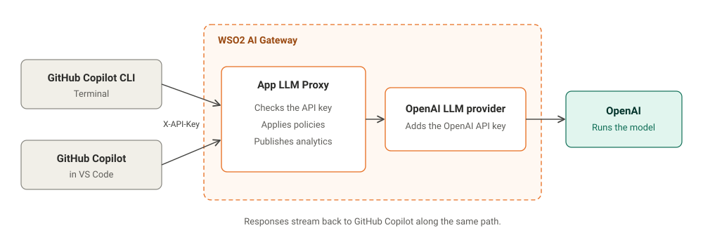
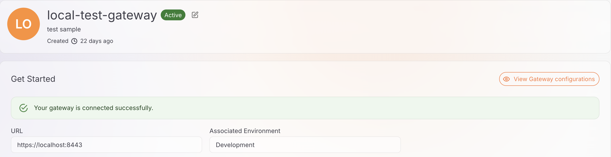
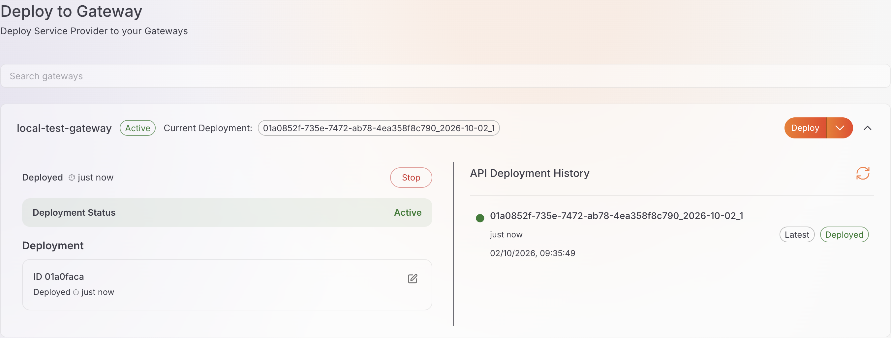
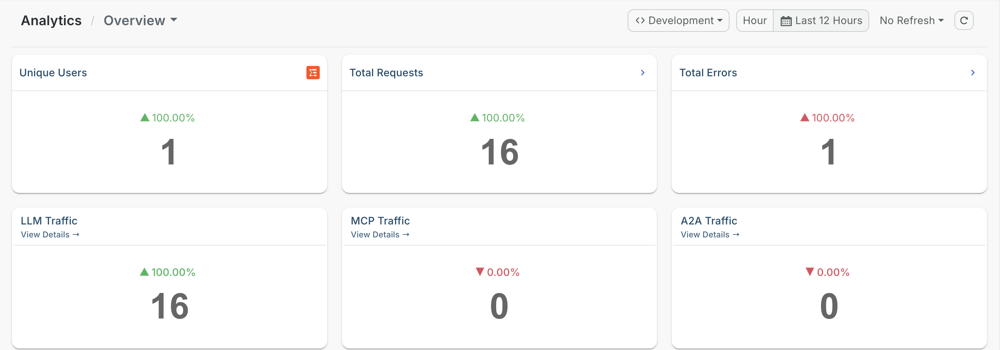
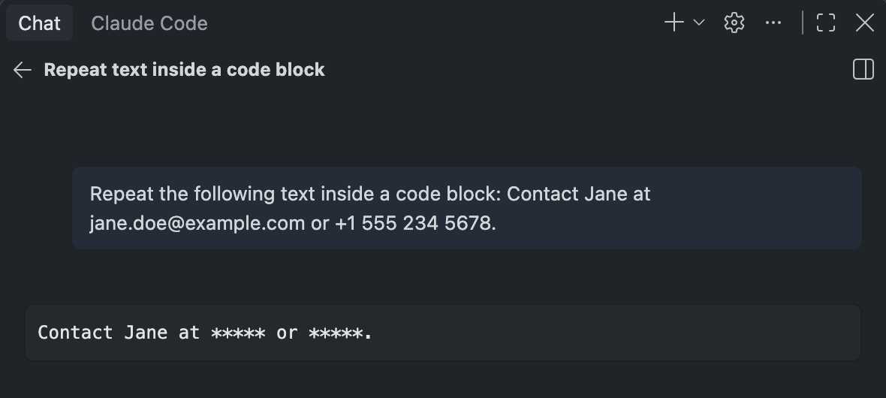
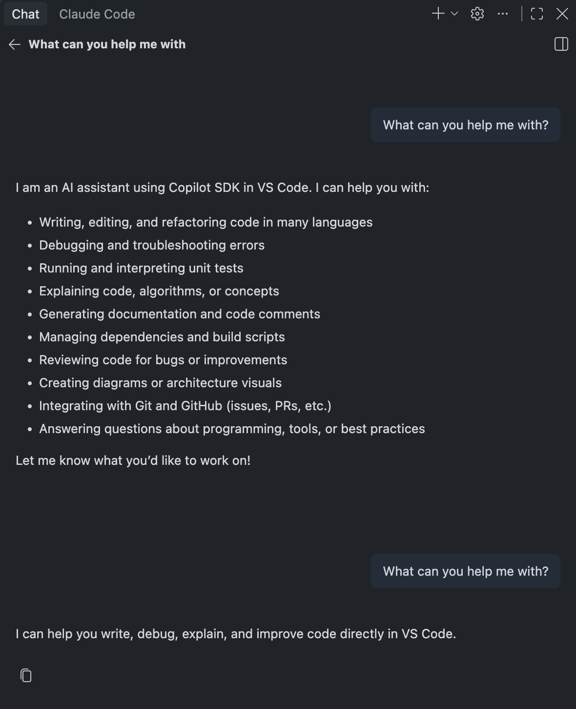

# Configuring GitHub Copilot with AI Gateway

## Overview

GitHub Copilot uses GitHub-hosted models by default. Its bring your own key (BYOK) option lets you point GitHub Copilot at a model provider of your choice instead.

This guide shows you how to use BYOK to route GitHub Copilot requests through the WSO2 AI Gateway to OpenAI. When developers connect GitHub Copilot to OpenAI directly, each developer needs the OpenAI API key, and there is no central place to control or track how GitHub Copilot is used. By the end, you'll have GitHub Copilot sending requests to an App LLM Proxy on the WSO2 AI Gateway, where each request is authenticated with a WSO2 API Platform API key, governed by the policies you attach, and recorded in Insights.

The guide covers two GitHub Copilot clients.

- **GitHub Copilot CLI**, the terminal assistant
- **GitHub Copilot in Visual Studio Code (VS Code)**, using Copilot Chat

## Learning objectives

- Route GitHub Copilot requests to OpenAI through an App LLM Proxy, so developers use a WSO2 API Platform API key and never handle the OpenAI API key
- Configure GitHub Copilot CLI and GitHub Copilot in VS Code to send requests to a custom endpoint using BYOK
- Set up SSL certificate trust so GitHub Copilot can connect to an AI Gateway that uses a self-signed certificate
- Control GitHub Copilot usage by attaching guardrail, rate limit, and prompt decorator policies to the App LLM Proxy
- Monitor GitHub Copilot token usage and cost in Insights

## Key concepts

This guide uses the following terms.

- *AI Workspace* is where you create and manage AI Gateways, LLM providers, App LLM Proxies, and the policies attached to them.
- *AI Gateway* is the runtime that receives requests from GitHub Copilot and enforces the policies attached to the App LLM Proxy.
- *LLM provider* is a registered connection to a model provider, such as OpenAI. It stores the provider's API key, so developers don't need it.
- *App LLM Proxy* is the endpoint that GitHub Copilot calls. It sits in front of the LLM provider, and it's where you attach policies.
- *Policy* is a rule that the AI Gateway applies to each request, such as a guardrail, a rate limit, or a prompt decorator.
- *Bring your own key (BYOK)* is the GitHub Copilot option that sends requests to a model provider you configure instead of to GitHub-hosted models. In VS Code, a model added this way is called a custom endpoint model.

---

## How the request flow works

When a developer selects a model configured with BYOK, GitHub Copilot sends the chat and agent requests for that model to the URL configured for the model, instead of to GitHub-hosted models. In this setup, that URL is the invoke URL of an App LLM Proxy deployed on the WSO2 AI Gateway.

The following diagram shows how a GitHub Copilot request travels through the WSO2 AI Gateway.

[](../../../assets/img/guides/ai-and-mcp/ai-coding-assistants/github-copilot/request-flow.svg)

1. **GitHub Copilot to the App LLM Proxy.** GitHub Copilot CLI or GitHub Copilot in VS Code sends the request to the App LLM Proxy, with the WSO2 API Platform API key in the `X-API-Key` header.
2. **Policy enforcement.** The App LLM Proxy checks the API key, applies the policies attached to the proxy, such as guardrails, rate limits, and prompt decorators, and publishes analytics.
3. **Forwarding to OpenAI.** The OpenAI LLM provider adds the OpenAI API key and forwards the request to OpenAI.
4. **Response.** OpenAI streams the response back through the WSO2 AI Gateway to GitHub Copilot.

This setup provides the following benefits.

- Developers never hold the OpenAI API key. The key is stored only in the OpenAI LLM provider.
- Each developer or team can use a separate WSO2 API Platform API key, which you can revoke without affecting others.
- You can add or change policies at the WSO2 AI Gateway without changing GitHub Copilot settings.

---

## Prerequisites

Before you begin, make sure you have the following.

- A WSO2 API Platform account. [Sign up for free](https://console.bijira.dev/).
- AI Workspace access with an Admin role.
- An [OpenAI API key](https://platform.openai.com/api-keys)
- One of the following GitHub Copilot clients:
    - [GitHub Copilot CLI](https://docs.github.com/en/copilot/how-tos/copilot-cli/set-up-copilot-cli/install-copilot-cli) installed
    - [VS Code](https://code.visualstudio.com/) with GitHub Copilot installed

!!! note "Using a GitHub Copilot Business or Enterprise plan with VS Code?"
    Your organization administrator must enable the **Bring Your Own Language Model Key in VS Code** policy. For more information, see the [VS Code language models documentation](https://code.visualstudio.com/docs/agent-customization/language-models).

---

## Step 1: Start an AI Gateway in AI Workspace

!!! note
    If an AI Gateway is already created and active, continue to Step 2.

1. Log in to the **WSO2 API Platform Console**.

2. Create an organization, or select an existing organization from the header at the top of the page.

3. Click **AI Workspace** in the header.

4. In the left navigation panel, click **AI Gateways**.

5. Select an existing gateway, or click **Add AI Gateway** to create one.

6. Follow the instructions shown on the gateway page to download, configure, and start the gateway.

For more information, see [Set up an AI Gateway in AI Workspace](../../../cloud/ai-workspace/ai-gateways/setting-up.md).

Once the gateway status shows as **Active**, continue to Step 2. The following screenshot shows an active AI Gateway.

[](../../../assets/img/guides/ai-and-mcp/ai-coding-assistants/github-copilot/ai-gateway-active.png)

---

## Step 2: Create and deploy an OpenAI LLM provider

### Create an OpenAI LLM provider

1. In the left navigation panel of AI Workspace, navigate to **LLM → LLM Providers**.

2. Click **Add New Provider**.

3. Select **OpenAI** as the LLM service provider.

4. Enter the required provider details.

5. In the **API Key** field, enter your OpenAI API key.

6. Click **Add Provider**.

### Deploy the OpenAI LLM provider to the AI Gateway

1. On the page that opens after creating the provider, click **Deploy to Gateway**.

2. Find the active AI Gateway where you want to deploy the OpenAI provider.

3. Click **Deploy** next to that gateway.

The OpenAI LLM provider is now deployed to the selected AI Gateway, as shown in the following screenshot.

[](../../../assets/img/guides/ai-and-mcp/ai-coding-assistants/github-copilot/openai-provider-deployed.png)

---

## Step 3: Create and deploy an App LLM Proxy

The App LLM Proxy is the endpoint that GitHub Copilot invokes through WSO2 API Platform.

1. Click **Back to Service Provider** to return to the OpenAI provider overview page.

2. Click **Create App LLM Proxy**.

3. Select a project. The default project is usually named **Default**.

4. Click **Continue**.

5. Provide a name for the App LLM Proxy.

6. Provide the other required information.

7. Under **Provider Configuration**, select the OpenAI LLM provider you created earlier.

8. Under **API Keys**, click **Generate API Key**.

9. Click **Create Proxy**.

### Deploy the App LLM Proxy to the AI Gateway

1. Click **Deploy to Gateway**.

2. Find the active AI Gateway where you deployed the OpenAI LLM provider.

3. Click **Deploy** next to that gateway.

The App LLM Proxy is now deployed to the selected AI Gateway.

### Generate an API key for GitHub Copilot

GitHub Copilot needs an API key from WSO2 API Platform to invoke the deployed App LLM Proxy.

1. Click **Back to App LLM Proxy**.

2. Under **App LLM Proxy Keys**, click **Generate API Key**.

3. Provide a name for the API key.

4. Click **Generate**.

5. Copy and save the generated API key.

    This is the API key that must be provided to GitHub Copilot using the `X-API-Key` custom header.

6. In the **Overview** tab, copy and save the **Invoke URL**.

You use these values when configuring GitHub Copilot.

---

## Step 4: Configure SSL certificate trust

When using a local WSO2 AI Gateway over HTTPS, GitHub Copilot must be able to trust the certificate presented by the gateway.

If the AI Gateway uses a certificate signed by a trusted certificate authority (CA), skip this step.

If the gateway uses a self-signed certificate, add the gateway certificate to your operating system's trust store. GitHub Copilot CLI and VS Code both use this trust store by default.

1. Extract the gateway certificate and save it as `gateway_certificate.pem` in the current directory.

    ```bash
    echo -n | openssl s_client -connect localhost:8443 2>/dev/null | sed -ne '/-BEGIN CERTIFICATE-/,/-END CERTIFICATE-/p' > gateway_certificate.pem
    ```

    On Windows, run this command in Git Bash.

2. Add the certificate to your operating system's trust store.

    === "macOS"

        ```bash
        security add-trusted-cert -r trustRoot -k ~/Library/Keychains/login.keychain-db gateway_certificate.pem
        ```

    === "Linux (Ubuntu or Debian)"

        ```bash
        sudo cp gateway_certificate.pem /usr/local/share/ca-certificates/gateway_certificate.crt
        sudo update-ca-certificates
        ```

    === "Windows (PowerShell)"

        ```powershell
        certutil -user -addstore Root gateway_certificate.pem
        ```

3. If VS Code is open, restart it.

For more information about VS Code, see the [VS Code network connections documentation](https://code.visualstudio.com/docs/setup/network).

!!! note "Local testing only"
    For local testing only, you can use the gateway's HTTP endpoint instead of the Invoke URL, for example `http://localhost:8080/<PROXY CONTEXT>`. Do not use HTTP in production, because the API key and prompts are sent unencrypted.

---

## Step 5: Connect GitHub Copilot to the App LLM Proxy

Follow the option for the GitHub Copilot client you use.

### Option 1: GitHub Copilot CLI

GitHub Copilot CLI reads its model provider settings from environment variables.

#### Configure environment variables

Open a terminal session where you want to run GitHub Copilot CLI.

Run the following commands, replacing the placeholders with your values.

```bash
export COPILOT_PROVIDER_TYPE="openai"
export COPILOT_PROVIDER_BASE_URL="<INVOKE URL>"
export COPILOT_PROVIDER_HEADERS="X-API-Key: <API PLATFORM API KEY>"
export COPILOT_MODEL="gpt-4.1"
```

Replace the placeholders as follows.

- `<INVOKE URL>` with the Invoke URL copied from the App LLM Proxy overview page
- `<API PLATFORM API KEY>` with the API key generated from WSO2 API Platform for the App LLM Proxy

!!! note
    `COPILOT_MODEL` must be a model that the LLM provider behind the App LLM Proxy supports, such as `gpt-4.1` for OpenAI. GitHub Copilot CLI also requires the model to support tool calling and streaming. For more information, see [GitHub Copilot CLI's official documentation](https://docs.github.com/en/copilot/how-tos/copilot-cli/customize-copilot/use-byok-models).

!!! note
    These environment variables apply only to the current terminal session. To make the configuration permanent, add them to your shell profile, such as `~/.zshrc` or `~/.bashrc`.

#### Run GitHub Copilot CLI

After setting the required environment variables, run GitHub Copilot CLI.

```bash
copilot
```

GitHub Copilot CLI sends requests through WSO2 API Platform instead of directly calling OpenAI.

### Option 2: GitHub Copilot in VS Code

Copilot Chat in VS Code connects to the App LLM Proxy as a custom endpoint model.

#### Add the App LLM Proxy as a custom endpoint

1. In VS Code, open the **Chat** view.

2. Open the model picker and click **Manage Language Models**.

    You can also run **Chat: Manage Language Models** from the Command Palette.

3. Click **Add Models**, and then select **Custom Endpoint**.

4. Provide a group name for the models. For example, `WSO2 AI Gateway`.

5. Provide a display name, and enter the API key generated from WSO2 API Platform for the App LLM Proxy.

6. Select **Chat Completions** as the API type.

    VS Code opens the `chatLanguageModels.json` file.

7. In `chatLanguageModels.json`, fill in the empty `id`, `name`, and `url` fields of the model entry, and add a `requestHeaders` field. Keep the other values that VS Code generated.

    ```json
    {
      "id": "gpt-4.1",
      "name": "GPT-4.1 (WSO2 AI Gateway)",
      "url": "<INVOKE URL>/chat/completions",
      "toolCalling": true,
      "vision": true,
      "maxInputTokens": 128000,
      "maxOutputTokens": 16000,
      "requestHeaders": {
        "X-API-Key": "${apiKey}"
      }
    }
    ```

    Replace `<INVOKE URL>` with the Invoke URL copied from the App LLM Proxy overview page. The `requestHeaders` field sends the WSO2 API Platform API key using the `X-API-Key` custom header.

8. Save the file.

#### Use Copilot Chat with the App LLM Proxy

1. Open the **Chat** view in VS Code.

2. In the model picker, under **Other Models**, select **GPT-4.1 (WSO2 AI Gateway)**.

3. Send a prompt.

Copilot Chat sends requests through WSO2 API Platform instead of directly calling OpenAI.

!!! note
    The WSO2 AI Gateway governs the GitHub Copilot requests that use the model you configure in this guide. Other GitHub Copilot features continue to use GitHub's services. The bring your own key (BYOK) options in GitHub Copilot are controlled by GitHub and might change. For the latest information, see the [GitHub Copilot CLI documentation](https://docs.github.com/en/copilot/how-tos/copilot-cli/customize-copilot/use-byok-models) and the [VS Code language models documentation](https://code.visualstudio.com/docs/agent-customization/language-models).

---

## Use case examples

### View analytics

By routing GitHub Copilot requests through the WSO2 AI Gateway, you automatically gain access to built-in analytics and reporting capabilities.

WSO2 AI Gateway provides integrated analytics, powered by Moesif.

To view the analytics, click **Insights** in the left navigation panel of AI Workspace.

[](../../../assets/img/guides/ai-and-mcp/ai-coding-assistants/github-copilot/insights-overview.png)

For more information, see [Integrate with Moesif](https://wso2.com/api-platform/docs/monitoring-and-insights/integrate-bijira-with-moesif/).

---

### Apply guardrails

WSO2 AI Gateway guardrails enable granular control over the data exchanged between GitHub Copilot and the OpenAI API.

By applying guardrails, you can enforce security and compliance policies such as the following.

- Input validation to ensure prompt integrity
- Output filtering to prevent leakage of sensitive data
- Rate limiting to control API usage and avoid cost overruns

For example, you can configure a **PII Masking Regex Guardrail** in the request flow to prevent Personally Identifiable Information (PII) from reaching the OpenAI API. If a user submits a prompt containing PII, the guardrail evaluates the request against defined patterns and redacts them before they reach the OpenAI API.

The following screenshot shows Copilot Chat in VS Code responding to a prompt that contains an email address and a phone number, with the PII Masking Regex Guardrail configured to redact PII.

[](../../../assets/img/guides/ai-and-mcp/ai-coding-assistants/github-copilot/guardrail-pii-redacted.png)

For more information, see [PII masking regex guardrail](https://wso2.com/api-platform/docs/ai-gateway/llm/guardrails/pii-masking-regex/).

---

### Limit request rates

WSO2 AI Gateway supports request-based and token-based rate limiting for AI APIs. This allows you to control GitHub Copilot usage when requests are routed through the gateway.

For example, you can add a **Rate Limit - Basic** policy to the App LLM Proxy from the **Guardrails & Policies** tab, and set the number of requests allowed within a time window. The gateway enforces this limit on all requests to the proxy. If the configured limit is exceeded, subsequent requests are throttled until the time window resets.

This helps control token consumption and avoid unexpected costs.

The following screenshot shows GitHub Copilot CLI receiving a rate limit response after the configured limit is reached.

[](../../../assets/img/guides/ai-and-mcp/ai-coding-assistants/github-copilot/rate-limit-exceeded.png)

For more information, see [Policies overview](https://wso2.com/api-platform/docs/ai-workspace/policies/overview/).

---

### Add instructions with a prompt decorator

WSO2 AI Gateway supports Prompt Decorators, which allow you to modify or enrich prompts before they are sent to the backend AI provider. This is useful for enforcing consistent instructions, adding system-level context, or guiding model behavior without requiring changes in the client application.

For example, you can configure a Prompt Decorator in the request flow to append an instruction to every prompt.

The following screenshot shows Copilot Chat in VS Code responding to the same prompt twice. The first response is without a Prompt Decorator. The second response is with a Prompt Decorator configured to append the following decoration: "Answer in one short sentence."

[](../../../assets/img/guides/ai-and-mcp/ai-coding-assistants/github-copilot/prompt-decorator-before-after.png)

For more information, see [Prompt decorator](https://wso2.com/api-platform/docs/ai-gateway/llm/prompt-management/prompt-decorator/).