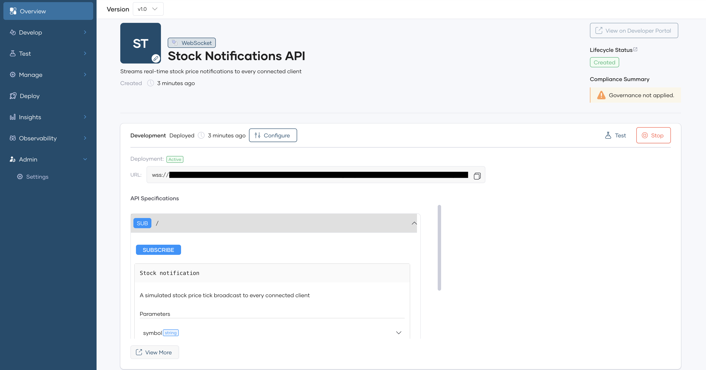
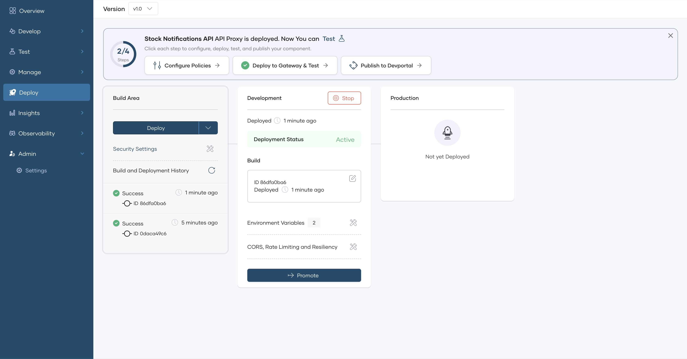
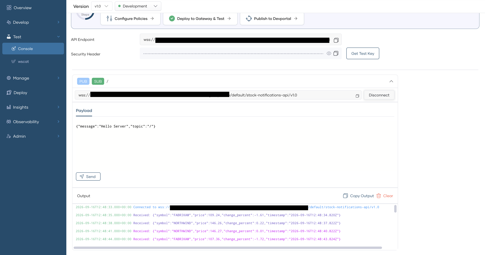

# Build a WebSocket-based real-time notification system

## Overview

A WebSocket API keeps a single connection open between the client and the server, so the server pushes each notification the moment it happens, instead of the client asking for it. This guide shows you how to front a WebSocket backend with a WebSocket API proxy on WSO2 API Platform Cloud, deploy it, and confirm that every connected client receives the same notification at the same time.

The backend in this guide is a sample WebSocket server that streams simulated stock price notifications every few seconds. The pattern applies to any backend that pushes notifications on its own schedule, such as order status updates or system alerts. By the end, you'll have a deployed WebSocket API proxy that you tested with two concurrent connections to confirm broadcast delivery.


## Key concepts

Before you start, here are the WSO2 API Platform terms this guide uses:

A *WebSocket API proxy* is the API type in WSO2 API Platform for exposing a backend that communicates over the WebSocket protocol. A single connection stays open between the client and the server and carries messages in both directions.

*AsyncAPI* is the specification format WSO2 API Platform uses to describe a WebSocket API's channels and message payloads. It serves the same purpose for a WebSocket API that OpenAPI serves for a REST API.

A *broadcast* is a message that a backend sends once and that reaches every client connected to the same channel at that moment. A real-time notification system depends on this behavior.

## Prerequisites

- A WSO2 API Platform Cloud account. Sign up for free at [console.bijira.dev](https://console.bijira.dev).
- A place to deploy and host the sample WebSocket server so it's reachable from the public internet. WSO2 API Platform needs a `wss://` URL it can connect to as a backend, so a server running only on `localhost` doesn't work. The public URL of the deployed sample WebSocket server should be used.
- Node.js 18 or later, if you want to run the backend code in this guide as-is.

## Architecture

```
Client A (browser tab)          Client B (browser tab)
        |                                |
        |  wss://.../stock-notifications-api
        v                                v
+--------------------------------------------------+
|            WSO2 API Platform Gateway              |
|  WebSocket API proxy: connection tracking,        |
|  OAuth2 enforcement, broadcast relay              |
+--------------------------------------------------+
                       |
                       v
   Stock notification server (your public wss:// URL)
```

The stock notification server generates a price tick on its own schedule and sends it to every connection it holds open at that moment. The gateway doesn't originate any messages; it relays whatever the backend sends to every client connected to the same proxy, so both tabs receive each tick at the same time.

## Step 1: Create an organization and project

Sign in to the [API Platform Console](https://console.bijira.dev), and create an organization and a project if you don't already have one. See the [API proxy quick start guide](../../cloud/introduction/quick-start-guide.md) for the full walkthrough.

## Step 2: Set up the sample notification backend

Before you create the API proxy, you need a running WebSocket server that WSO2 API Platform can reach over the public internet. This guide uses a sample server that picks one of four sample stock symbols at random every 3 seconds, generates a simulated price for it, and sends the result to every client connected at that moment.

1. Get `server.js` and `package.json` from the [companion sample](https://github.com/wso2/api-platform/tree/main/samples/websocket-notification-system) into a project folder. These are the same files the sample runs locally.
2. In that folder, run `npm install` to install the server's one dependency, `ws`.
3. Deploy the sample WebSocket server, and obtain a `wss://` URL.

**Expected result:** You have a `wss://` URL for the deployed server. You use this URL in the next step.


## Step 3: Create the WebSocket API proxy

In this guide, you import an AsyncAPI contract that describes the notification channel, then point it at the backend you deployed in Step 2.

1. On the project home page, if you already have one or more components in your project, click **+ Create**. Otherwise, continue to the next step.
2. Select **API Proxy** and click **Import API Contract**.
3. Select **WebSocket** as the **API Type**.
4. Select **URL**, and provide the following URL to import the API contract: 

    ```text
    https://raw.githubusercontent.com/wso2/api-platform/refs/heads/main/samples/websocket-notification-system/asyncapi.yaml
    ```

5. Click **Next**. On the pre-filled details page, replace the **Target** value with the `wss://` URL from Step 2, and update the remaining fields as follows:

    | Field | Value |
    |---|---|
    | **Name** | Stock Notifications API |
    | **Identifier** | stock-notifications-api |
    | **Description** | Streams real-time stock price notifications to every connected client |

6. Click **Create**.

**Expected result:** WSO2 API Platform creates the API proxy, with a channel generated from the AsyncAPI contract and its target pointing to your notification backend. Wait for the setup to complete before continuing.

{.cInlineImage-full}

## Step 4: Configure and deploy the API proxy

Creating the API proxy from a contract deploys it to the Development environment automatically. Redeploying, as you'll do here, is what you'd repeat any time you make a configuration change.

1. In the left navigation menu, click **Deploy**.
2. In the **Build Area** click **Deploy**.

**Expected result:** The deployment status shows as **Active**.

{.cInlineImage-full}

## Step 5: Test broadcast delivery with the WebSocket Console

The WebSocket Console lets you connect to your deployed proxy without writing any client code. Because the backend pushes notifications on its own schedule, you don't send anything yourself; you connect two browser tabs and watch both receive the same notifications at the same time.

1. In the left navigation menu, click **Test**, then click **Console**.
2. Expand the `/` channel, and click **Connect**.

    {.cInlineImage-full}

4. Open a second browser tab to the same **Console** page, and repeat steps 2 and 3 to connect a second client.
5. Wait a few seconds. A stock price notification appears in the **Output** section of both tabs at the same time.

**Expected result:** Both tabs show the identical notification, with the same symbol, price, and timestamp, confirming both connected clients received the same broadcast.


## What you learned

- Deployed a WebSocket backend that streams notifications on its own schedule, independent of any client action
- Created a WebSocket API proxy by importing an AsyncAPI contract, then pointed its target at your own deployed backend
- Deployed and tested broadcast delivery using two concurrent connections in the WebSocket Console


## Try the sample

The companion sample contains the exact backend and AsyncAPI contract this guide uses: `server.js`, `package.json`, and `asyncapi.yaml`. Run it locally with `npm install && npm start` to confirm it works before deploying it, or go straight to the guide's Step 2 to deploy it publicly.

[View the sample on GitHub](https://github.com/wso2/api-platform/tree/main/samples/websocket-notification-system)