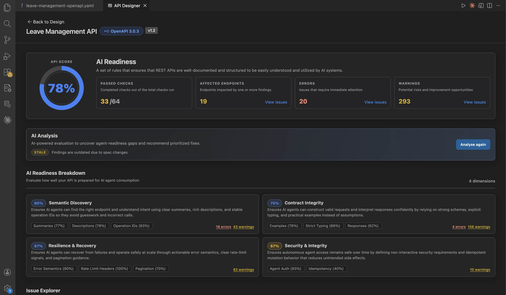

# Govern APIs using API Designer

You can use API Designer to assess and improve your OpenAPI 3.x specification for AI readiness, design quality, and secure production use.



## Why this matters

- AI agents rely on clear descriptions, examples, and predictable API behavior.
- Early governance helps you improve specification quality before publishing.

## What you can review

API Designer applies governance checks using Spectral rulesets and AI. You can review:

- Overall scores and summary metrics.
- Category-level breakdown to quickly identify weak areas.
- Violations grouped by rule, severity, or area of the specification.

## Reports in API Designer

API Designer includes the following reports:

| Report focus | What it emphasizes |
|---------------|-------------------|
| **WSO2 REST API AI Readiness Guidelines** | Readiness for AI agents and automated clients |
| **WSO2 REST API Design Guidelines** | REST design quality and consistency |
| **OWASP API Security Top 10** | API security best-practice checks |

## AI readiness first

AI readiness is a core governance area in API Designer. It helps you identify specification issues that block reliable agent usage.

Focus on these first:

- Missing or weak operation ids, summaries and descriptions.
- Incomplete request and response examples.
- Ambiguous parameter or schema intent.
- Contract gaps that reduce machine readability.

For each issue, review the provided details to understand what is wrong and why it affects agent behavior.

### AI-assisted analysis (AI readiness)

For **AI readiness**, API Designer combines **rule-based** results with **AI-assisted** narrative analysis: not only *what* failed a rule, but *why it matters* for agents and tools (for example ambiguous descriptions, weak examples, or gaps that cause wrong calls).

You can run AI analysis on demand and get AI feedback to improve your specification.

## How to fix findings

You can resolve findings using:

1. **GitHub Copilot Chat with the `api-design` skill**  
   Use this for targeted fixes or rule-driven remediation.
2. **Form-based editing in Design**  
   Use this for precise changes to operations, parameters, responses, and schemas.

## Important

- Some fixes are **breaking** (for example path renames). Treat those as API **versioning** decisions, not silent edits.
- Security items may require **real** URLs, policies, or auth server metadata—do not invent production values with AI.

## Custom rulesets and overrides

By default, API Designer runs the three bundled Spectral rulesets listed above. You can point it at a ruleset folder instead, either to override individual rules or to replace a report's rules entirely. Configure this from the settings user interface (UI), or by editing `settings.json` directly.

**Using the Settings UI:**

1. Open **Settings**: press <kbd>Ctrl+,</kbd> (<kbd>Cmd+,</kbd> on macOS). You can also open the **Command Palette** (<kbd>Ctrl+Shift+P</kbd> / <kbd>Cmd+Shift+P</kbd>) and run **Preferences: Open Settings (UI)**.
2. Search for `apiDesigner.spectral.rulesetFolder`.
3. Choose the **User** tab to apply the setting across all of VS Code, or the **Workspace** tab to scope it to the current project.
4. Enter a GitHub folder URL (for example `https://github.com/<org>/<repo>/tree/main/<path>`) or an absolute local directory path. API Designer rescans the folder automatically.

**Using `settings.json`:**

1. Open the **Command Palette** (<kbd>Ctrl+Shift+P</kbd> / <kbd>Cmd+Shift+P</kbd>).
2. Run **Preferences: Open User Settings (JSON)** for a setting shared across all of VS Code, or **Preferences: Open Workspace Settings (JSON)** to scope it to the current project.
3. Add the setting:

   ```json
   {
     "apiDesigner.spectral.rulesetFolder": "https://github.com/<org>/<repo>/tree/main/<path>"
   }
   ```

Use the Workspace option (`.vscode/settings.json`) when different projects need different ruleset folders. Otherwise, a single User-level setting applies to every workspace you open.

**Start from the bundled rulesets.** The simplest way to build a custom ruleset is to copy WSO2's bundled ones and customize them: [WSO2 bundled Spectral rulesets](https://github.com/wso2/vscode-extensions/tree/main/workspaces/api-designer/api-designer-extension/spectral-rulesets).

**Name your file to match the report you're overriding:**

| Report | Required filename |
|---|---|
| WSO2 REST API AI Readiness Guidelines | `ai-readiness.yaml` |
| OWASP API Security Top 10 | `owasp_top_10.yaml` |
| WSO2 REST API Design Guidelines | `wso2_rest_api_design_guidelines.yaml` |

**Overriding an existing rule vs. adding a new one:** editing an existing rule works correctly across all three reports. If you want to add new rules to OWASP, use the same format as the bundled rules—`owasp:apiN:2023-<description>` (for example `owasp:api1:2023-custom-check`)—so they're categorized correctly. For REST API Design Guidelines, new rules are grouped under a general **Others** category instead of a specific theme. We recommend against adding new rules to AI Readiness, since that report doesn't support them.

If a custom ruleset fails to load or parse, API Designer shows a warning. It then falls back to the bundled default for that report, so analysis is never blocked.

**Debugging ruleset failures**

If a report unexpectedly shows the bundled default instead of your custom ruleset, check the **API Designer** output channel for the underlying error:

1. Open the **Command Palette** (<kbd>Ctrl+Shift+P</kbd> / <kbd>Cmd+Shift+P</kbd>) and run **View: Toggle Output**. You can also use **View > Output** from the menu.
2. In the output panel's channel dropdown (top right), select **API Designer**.
3. Re-run analysis and look for a `[Governance]` or `[Spectral]` log line describing the failure. For example, a YAML (YAML Ain't Markup Language) parse error, a missing `rules` property, or a `401` or `403` error on a private GitHub folder.

Fix the reported issue in your ruleset file. For a `401` or `403` on a private GitHub folder, check your GitHub sign-in and repository access. Then re-run analysis to confirm the custom ruleset now loads.

## Related topics

- [Design APIs with API Designer](./design-apis.md) — create and refine your specification
- [End-to-end tutorial](./end-to-end-tutorial.md) — full flow from draft to governance